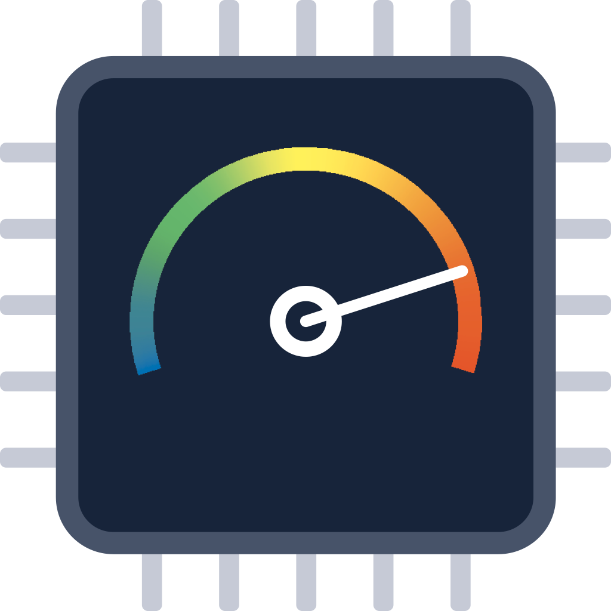

<div align="center">
  

  <h1>CPU Cores</h1>

  <p>
    A fast, native system monitor for iPhone and iPad.<br>
    Per-core CPU load, memory, storage, hardware diagnostics and widgets — all at a glance.
  </p>

  <p>
    
    
    
    
    
  </p>

  <p>
    <a href="https://github.com/Lampadina17/CpuCores/releases/latest"><strong>Download the latest release</strong></a>
    ·
    <a href="altstore://source?url=https://lampadina17.github.io/CpuCores/source.json">Add to AltStore PAL</a>
    ·
    <a href="https://github.com/Lampadina17/CpuCores/issues">Report a bug</a>
  </p>
</div>

---

## Your device, explained in real time

CPU Cores turns low-level system readings into a clean, responsive dashboard designed for both iPhone and iPad. It is lightweight, fully native and processes device statistics locally.

### Highlights

* **Live CPU monitoring** — total usage and individual load for every logical core.
* **Memory breakdown** — used, free, active, inactive and wired RAM.
* **Storage overview** — total, used and available device capacity.
* **Home Screen widgets** — small, medium and large layouts on iOS 14 and later.
* **Lock Screen widgets** — circular, rectangular and inline families on iOS 16 and later.
* **Hardware details** — model, board, architecture, core count, RAM, display, storage, thermal state and uptime.
* **Battery diagnostics** — health, wear, maximum capacity, design capacity and cycle count on compatible privileged installations.
* **System cleanup tools** — controlled memory pressure and APFS purge requests, always leaving the final decision to iOS.
* **Configurable widget refresh** — choose an interval from 1,000 to 5,000 ms for the silent-audio keep-alive.
* **Ten localizations** — English, Italian, German, Spanish, French, Japanese, Polish, Russian, Simplified Chinese and Traditional Chinese.

## Engineering confidence

**4/10 — Verified AI-assisted prototype**

CPU Cores was developed largely through AI-assisted code generation and AI-led reverse engineering.

The implementation has been manually verified, tested and iterated on, but the codebase has not received the same level of deliberate architecture, manual implementation and long-term maintainability work as a mature production project.

The score reflects the **engineering process and maintainability of the codebase**, not whether the application works correctly.

## Compatibility

| Feature                      | Requirement                                                                                                             |
| ---------------------------- | ----------------------------------------------------------------------------------------------------------------------- |
| App and Home Screen widgets  | iOS or iPadOS 14.0+                                                                                                     |
| Lock Screen widgets          | iOS or iPadOS 16.0+                                                                                                     |
| Standard system statistics   | Any supported installation method                                                                                       |
| Advanced battery diagnostics | TrollStore, TrollStore Lite with an active jailbreak, or another environment granting the required private entitlements |

> [!IMPORTANT]
> Raw battery values are not exposed by the public iOS SDK. The standard/PAL build therefore shows them as **Unavailable** and does not compile the private battery implementation. The TrollStore build keeps the advanced diagnostics and may still show **Unavailable** when the OS/device does not expose the expected properties.

## Installation

Download the current packages from [GitHub Releases](https://github.com/Lampadina17/CpuCores/releases/latest).

### AltStore PAL

As an alternative to sideloading the `.ipa`, add the [CPU Cores source](https://lampadina17.github.io/CpuCores/source.json) to AltStore PAL and install the app directly from there.

AltStore PAL distributes the standard public-API build, so advanced battery fields are unavailable.

### Standard IPA

Use the unsigned `.ipa` release asset with a compatible signing or installation tool, such as:

* AltStore or SideStore
* Sideloadly
* AppSync Unified on a jailbroken device

This public-API build provides the complete dashboard and widgets. Battery level and charging state use `UIDevice`; advanced battery fields are unavailable because their private implementation is excluded at compile time. The same `Release` configuration is used for Xcode archives and PAL/notarization workflows.

### TrollStore package

Install the `.tipa` release asset with [TrollStore](https://github.com/opa334/TrollStore). This package is ad-hoc signed with the private battery and IOKit entitlements used by the hardware diagnostics.

TrollStore Lite can provide equivalent privileged access while its supporting jailbreak is active. Classic TrollStore remains the preferred option on versions supported by its CoreTrust installation method because it does not depend on an active jailbreak session.

## Build from source

### Requirements

* macOS
* A full Xcode installation with the iOS SDK
* Command Line Tools selected for that Xcode installation

Clone the repository and run the all-in-one build script:

```bash
git clone https://github.com/Lampadina17/CpuCores.git
cd CpuCores
./Scripts/build-all.sh Build
```

The script performs two independent compilations and creates both distributable packages inside `Build/` (the version below is illustrative):

```text
Build/
├── CpuCores-0.3.ipa
└── CpuCores-0.3-TrollStore.tipa
```

The standard IPA is unsigned so that the intended PAL/sideload signing pipeline can sign it. Its executable is built with the normal `Release` configuration and no TrollStore condition or private entitlements. The TIPA is compiled separately with `Scripts/TrollStore.xcconfig`, which defines `CPUCORES_TROLLSTORE=1` for C and `CPUCORES_TROLLSTORE` for Swift, and is then ad-hoc signed with `Scripts/TrollStore.entitlements`.

Before packaging, the script runs `Scripts/verify-pal-binary.sh` against the app and its embedded widget. The verifier checks strings, undefined symbols, linked libraries and embedded entitlements for the private battery implementation.

To develop or run a normally signed debug build, open `CpuCores.xcodeproj`, select the `CpuCores` scheme and choose your development team in Xcode.

## How widget refresh works

CPU Cores can use a silent, mixable audio session to keep requesting WidgetKit reloads while the app remains active in the background. The interval is configurable from the app settings.

This is an experimental sideload-oriented mechanism: the selected interval controls how often CPU Cores **requests** a reload, not a guaranteed WidgetKit update rate. iOS can throttle or suspend background work depending on device conditions, power state and system policy.

## Privacy

CPU Cores has no analytics or telemetry. System readings are calculated on the device and are not sent to a remote service.

## Contributing

Bug reports, compatibility results and focused pull requests are welcome. When reporting a device-specific issue, include:

* device model and iOS/iPadOS version;
* installation method;
* jailbreak and TrollStore version, when applicable;
* whether the issue also occurs after a clean reboot or reinstall.

---

<div align="center">
  Built for people who want to know what their device is actually doing.
</div>
